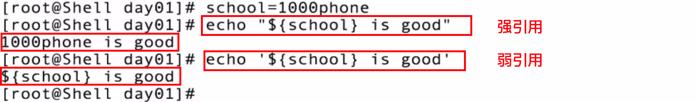
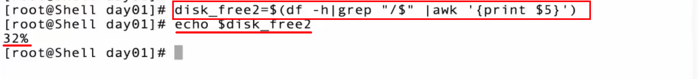
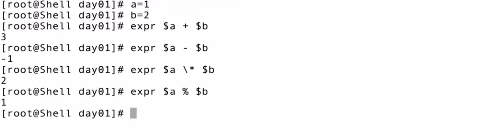
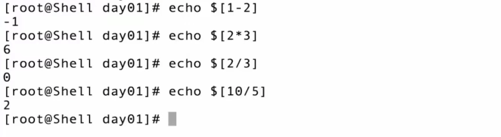

# 0 Shell脚本简介

**shell脚本（需要解释器解释）**

- 命令的堆积
- 特定的语法 + 特定的命令 = 文件
- auto.sh

**Shell脚本能做什么**

- 基于标准化之上的 -> 工具化

- 作用：简化操作步骤，提高效率，减少人为干预，减少系统故障

- 1. 自动化的完成基础配置：系统初始化操作、系统更新、内核调整、网络、时区、SSH优化
  2. 定期备份恢复程序：MySQL全备+增量+binlog + crond + Shell脚本
  3. 自动化信息的收集

  4. 自动化日志收集（ELK）
  5. 自动化扩容/缩容（zabbix + shell）：监控服务器，如果发现cpu持续80%，就自动调用api多开一个服务器云主机 -> 初始化环境 -> 加入集群
  6. ......

**shell知识点**

- 特性

- 变量
  - 自定义变量
  - 系统环境变量
  - 预先定义变量
  - 位置参数变量
  - 内置变量：continue、break、exit
- 条件变量：if else
- 循环语句：for while
- 流程控制：case
- 函数：function
- 数组：array
- 正则表达式
- 实例项目

## 0.1 基本格式

```bash
#!/usr/bin/bash    指定解释器，当使用./执行的时候，可以知道用什么解释器去执行，要执行还要添加执行权限：chmod +x test.sh
echo "hello"
```

## 0.2 执行方式

使用 `./test.sh` 执行脚本需要添加执行权限`chmod +x test.sh`

使用`sh test.sh`指定解释器执行不需要添加执行权限

## 0.3 前后台作业控制

前台作业：通过终端启动，运行时一直占用终端

后台作业：通过终端启动，但启动后转到后台运行

查看当前终端运行的所有作业： ==jobs==

**前台作业运行于后台的方法**

对于尚未运行的作业，在命令后面加上 ==&==

对于已经在前台运行的作业，按 ==CTRL+Z== 键

**后台作业转到前台**

若想将后台命令转到前台，可以用fg命令： fg 后面跟上jobs中所列出的后台命令编号，且编号前要加一个%号
此命令会把前一个的ping命令转向前台：==fg %1==

若要把前台命令转移到后台，可以用==bg==命令，用法与fg相同

**nohup与screen**

后台命令虽然在后台运行，但如果关闭他所在的终端，命令仍然会停止运行，若想防止此现象发生，就要剥离后台命令与其终端的关系，需要用到nohup或者screen

screen：直接在终端输入screen，就会打开一个screen，之后再在此终端下运行的命令，即使终端被关闭，命令也会照常运行

nohup：在命令前面加一个nohup，关闭终端后命令依旧在运行

## 0.4 输入输出重定向

| 命令            | 说明                                               |
| :-------------- | :------------------------------------------------- |
| command > file  | 将输出重定向到 file。                              |
| command < file  | 将输入重定向到 file。                              |
| command >> file | 将输出以追加的方式重定向到 file。                  |
| n > file        | 将文件描述符为 n 的文件重定向到 file。             |
| n >> file       | 将文件描述符为 n 的文件以追加的方式重定向到 file。 |
| n >& m          | 将输出文件 m 和 n 合并。                           |
| n <& m          | 将输入文件 m 和 n 合并。                           |
| << tag          | 将开始标记 tag 和结束标记 tag 之间的内容作为输入。 |

> 需要注意的是文件描述符 0 通常是标准输入（STDIN），1 是标准输出（STDOUT），2 是标准错误输出（STDERR）。

示例：

```shell
cat < /etc/hosts   > /etc/test.sql  #前半段cat < /etc/hosts是把hosts文件内容读取出来，后半段把这些内容追加到test.sql中
```

## 0.5 管道 ｜

｜：将前者命令的标准输入交给后者命令的输入

```shell
ps -elf | grep mysql  #前者列出进程，后者从这些进程中筛选出包含mysql串的
```

## 0.6 通配符

```shell
*   匹配任意多个字符
?   匹配任意一个字符
[]  匹配括号中任意一个字符，[a-z]，[0-9]
()  括号中的命令在子shell中执行 (cd boot ; ls)
{}  集合，touch file{0..9}，会创建file0,file1,file2..flie9
\   转义
```

## 0.7 echo和printf区别

echo：可以输出颜色

printf：格式化输出文本

```shell
echo -e "\033[31m 红色字 \033[0m" 
echo -e "\033[32m 绿色字 \033[0m"
```


## 0.8 强引用""和若引用''

双引号""，强引用，会解析里面的变量

单引号'，弱引用，所见即所得，不会解析里面的变量



反引号``用来解析shell命令

==双引号可以解析变量，但不能解析命令，如果要把命令扩起来，得用反引号==，注意：==反引号``等价于$()==

echo要想执行命令的话，命令得用$()扩起来，或者用反引号扩起来




# 1 变量

> 变量：用一个固定的字符串去表示一个不固定的类型

## 1.1 变量常见类型

**自定义变量**

```shell
# 定义变量
变量名=变量值
a=1
b=2

# 引用变量 $
$a
${a}  #$aa 会认为aa是一个变量名， ${a}a，会认为a是一个变量名，花括号外面的不会连带识别

# 查看变量
echo $a
set #显示所有变量，包括自定义变量和环境变量

# 取消变量
unset a

# 变量作用范围
仅在当前shell中有效
```

实例：ping通返回 ip ok，不通返回ip error：

```shell
#!/usr/bin/bash
IP=192.156.34.11
ping -c1 "$IP" &>/dev/null && echo "ip $IP ok" || echo "ip $IP error"  

#利用&&与||的短路特性：&& 第一个条件为真，会继续执行&&后面的，若也为真，则||表达式不会执行后面的；若&&第一个条件为假，则整个&&为假，直接去执行||后面的
```

**系统环境变量**

```shell
# 定义环境变量
export IP="192.168.12.11"

# 引用环境变量
$变量名 
${变量名}

# 查看环境变量
echo $变量名 env | grep xxx

# 取消环境变量
unset name

# 变量作用范围
全局

source ./ping.sh   #把ping.sh的代码加载过来
source /etc/init.d/functions  #加载系统的变量
```

**脚本参数传参**

```sh
$0 脚本名
$1 第一个参数
$2 第二个参数
$* 所有的参数
$@ 所有的参数
$# 参数的个数
$$ 当前进程的PID
$! 上一个后台进程的PID
$? 上一个命令的返回值，0表示成功
```

示例：ping ip，ping通返回ok，ip手动输入

```sh
sh ping.sh 192.168.11.21  #ping.sh是$0, 192.168.11.21就是$1
```

```sh
#!/usr/bin/bash
ping -c1 $1 &> /dev/null
	if [ $? -eq 0]; then  #$?上一条命令的返回值
		echo "$1 is ok"
	else
		echo "$1 is err"
	fi
```

## 1.2 变量赋值方式

```shell
# 显示赋值
变量名=变量值

# read从键盘读取变量值
read 变量名
read -p "变量信息:" 变量名


```

## 1.3 变量数值运算

**整数运算：expr、$(()、)[]、let**

```sh
expr 1 + 2  #注意数字后面必须有空格
```



或者用$(())：

```sh
echo $((5-3)*2)
```

或者用中括号：



或者用let

```sh
let sum=2+3
echo $sum
```

**小数运算：bc**

```sh
echo "1+2" |bc
echo "scale=2;6/4" |bc  #两位小数
```

# T13


## 1.4 变量删除替换


# 附录：命令

设置别名

```shell
alias tt="echo tt"  #这样设置以后，在shell输入tt，就相当于执行了echo tt

unalias tt  #取消tt的别名
```

# 附录：快捷键

## 1. 光标移动

```
  ctrl + <      移动到前一个单词开头
  ctrl + >      移动到后一个单词结尾
  ctrl + A      移动到开头
  ctrl + E      移动到结尾
  alt  + B      向左移动一个单词
  alt  + F      向右移动一个单词
  ctrl + B      向左移动一个字符
  ctrl + F      向右移动一个字符
  esc  + B      向左移动一个单词
  esc  + F      向右移动一个单词
  ctrl + XX     在上次光和当前光标所在字符间跳转
  esc  + T      交换光标位置前的两个单词
```

## 2. 删除

```
  ctrl + K      删除光标后所有字符(剪切)
  ctrl + U      删除光标前所有字符(剪切)
  ctrl + W      删除光标前一个单词
  ctrl + D      删除光标所在字符(光标右侧)
  ctrl + H      删除光标前字符(光标左侧)
```

## 3.撤销

```
  ctrl + _      撤销操作
  ctrl + Y      粘贴ctrl+U/K剪切的内容
  ctrl + ?      撤消前一次输入
  alt  + R      撤消前一次动作
```

## 4. 替换

```
  ctrl + T      将光标当前字符与前面一个字符替换
```

## 5. 历史命令编辑

```
  ctrl + P      上条输入的命令(相当于上键)
  ctrl + N      上条历史命(相当于下键)
  alt  + >      上一次执行命令
  ctrl + R      输入单词搜索历史命令
```

## 6. 控制命令

```
  ctrl + L      清除屏幕
  ctrl + S      锁住终端，阻止屏幕输出
  ctrl + Q      解锁终端，允许屏幕输出
  ctrl + C      终止命令&另起一行
  ctrl + I      补全功能(类似TAB)
  ctrl + O      重复执行命令
  alt  + <数字>  操作的次数
  ctrl + Z      挂起
```

## 7. !命令

```
  !!            执行上条命令
  !-n           执行前n条命令
```

## 8. tee命令

```shell
ping google.com | tee output.txt
# Linux tee命令用于读取标准输入的数据，并将其内容输出成文件。
```

## 9. 命令之间可以用；分割

；

```shell
cat /etc/hosts ; mkdir /test  #分号前后的两条命令没有逻辑联系，即使前一个命令执行出错，也不会影响后面命令的执行 
```

&&

```shell
cat /etc/hosts ; mkdir /test  #&&前后的两条命令有逻辑联系，前一个命令执行出错，后面的命令就不会执行
```

||

```shell
cat /etc/hosts ; mkdir /test  #||前后的两条命令有逻辑联系，前一个命令执行出错，才会执行后者；前一个命令执行成功，则不会执行后者
```

